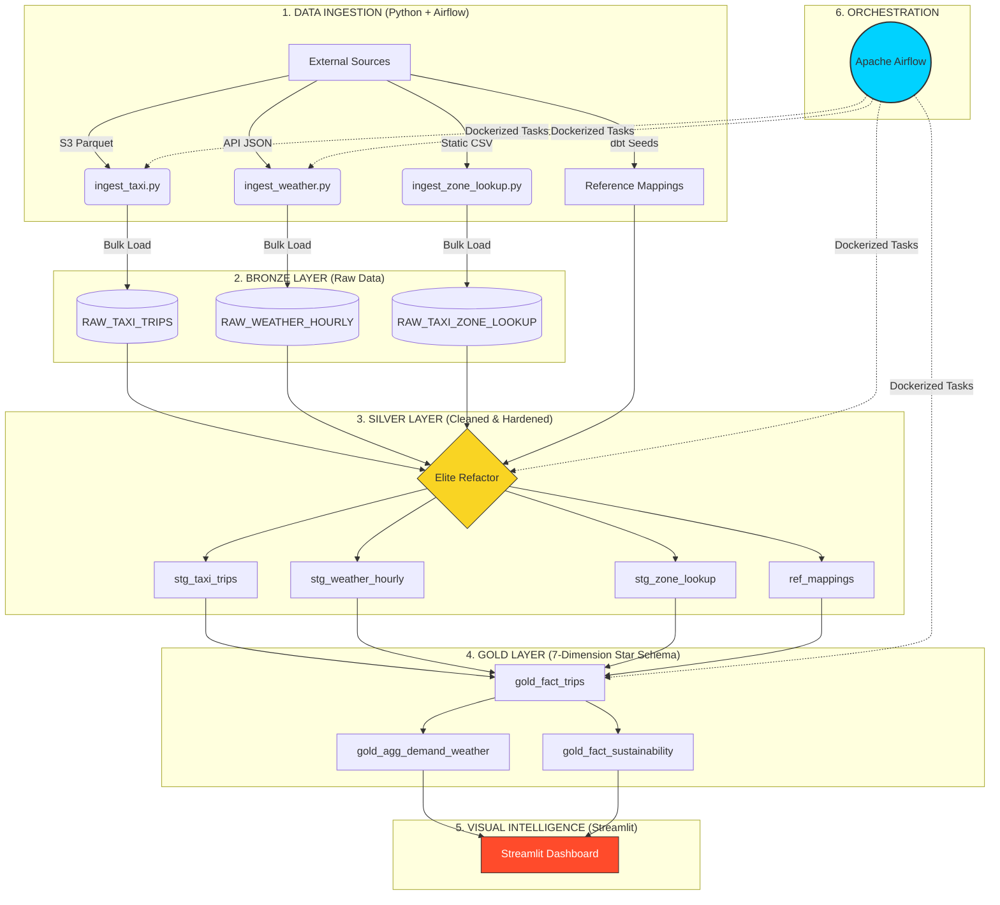
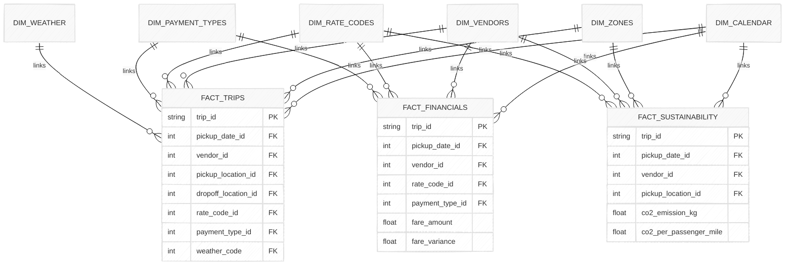

# UrbanFlow Analytics: Full-Stack Urban Intelligence Platform

## 🏙️ Project Overview
UrbanFlow Analytics is an end-to-end, production-grade data intelligence platform built for the **NYC Taxi & Limousine Commission (TLC)**. Moving beyond simple orchestration, this platform is a **Full-Stack Data Factory** designed to provide deep insights into urban mobility, financial integrity, and environmental sustainability.

By unifying millions of taxi trip records with high-resolution weather data and business reference mappings, we answer critical questions:
- **Demand Intelligence**: How do extreme weather events shift pickup density and rider behavior?
- **Financial Integrity**: Auditing fare patterns and airport flat rates for revenue protection.
- **Sustainability Mandate**: Calculating the carbon footprint of the NYC fleet and its correlation with traffic patterns.

## 🏗️ Architecture & Workflow
The platform follows an "Elite" implementation of the **Medallion Architecture**, hardened with audit metadata and production-grade guardrails.

### 🗺️ Full-Stack System Workflow

## 📊 Data Model (Star Schema)
Our Gold Layer is designed as a **Multi-Fact Star Schema**, enabling complex cross-functional analysis across mobility, finance, and environment.

## 🛠️ Tech Stack
- **Orchestration**: Apache Airflow (Dockerized)
- **Data Warehouse**: Snowflake
- **Transformation**: dbt Core (1.7+)
- **Visual Intelligence**: **Streamlit**
- **Ingestion**: Python (Pandas, Requests, Snowflake-Connector)
- **Environment**: Docker, Python 3.12, `uv`

---

## 🚀 Project Progress (The Elite Sprints)

### Sprint 1: Dimensional Foundation - ✅ 100% Complete (Hardened)
- [x] **Temporal Backbone**: Built `dim_calendar.sql` using Snowflake generator logic (Zero-IO).
- [x] **Relational Fact Pivot**: Refactored `gold_fact_trips` to link with Calendar and Zone dimensions.
- [x] **Reference Ingestion (Seeds)**: Implemented version-controlled mappings for Vendors, Payments, Rate Codes, and Emissions.

### Sprint 2: Silver Feature Engineering - ✅ 100% Complete
- [x] **Sustainability Engine**: Implemented CO2 calculations in `stg_taxi_trips` using vendor emission factors.
- [x] **Anomaly Detection**: Successfully flagged 81 outliers (Distance > 100mi, Fare > $500).
- [x] **Silver Quality Gates**: Hardened staging models with robust dbt tests.
- [x] **The Clean Aggregate**: Refactored `gold_agg_demand_weather` to exclude anomalies and include CO2 metrics.

### Sprint 3: The Multi-Fact Gold Layer - ✅ 100% Complete
- [x] **Financial Integrity Fact**: Dedicated table for airport flat-rate auditing (Successfully identified JFK $70 signal).
- [x] **Sustainability Fact**: Specialized grain for carbon emission analysis and policy intelligence (`is_short_efficiency_risk`).
- [x] **Multi-Fact Star Schema**: Finalized the conformed 7-Dimension, 3-Fact model (Trips, Financials, Sustainability).

### Sprint 4: Hardened Orchestration & Infrastructure - 🔄 In Progress
- [x] **Elite Ingestion Framework**: Refactored core infrastructure into a modular, OOP-based engine.
  - [x] **The Gatekeeper (Config)**: Centralized secret management with Fail-Fast validation.
  - [x] **The Engine (Database)**: Context-managed Snowflake client for leak-proof execution.
- [x] **The Blueprint (Base Ingestor)**: Implemented the Template Method Pattern for standardized job lifecycles.
- [ ] **Legacy Migration**: Refactoring functional scripts into the new Modular Framework (2/3 Completed - Zone & Weather).
- [ ] **Streamlit Executive Dashboard**: Interactive KPI reporting for TLC leadership.
- [ ] **Dockerized Airflow DAGs**: Final orchestration of the hardened pipeline.

---

## ⚙️ Project Setup & Commands Used

### 1. Python Environment Setup (using `uv`)
*   `uv venv --python 3.12`
*   `uv add requirements.txt`

### 2. dbt Elite Commands
*   `uv run dbt seed` - Loads the Reference Layer into Snowflake.
*   `uv run dbt run --select silver` - Materializes the Hardened Silver layer.
*   `uv run dbt run --select gold` - Finalizes the Analytics Star Schema.

### 📚 Learning Resources
Detailed architectural deep-dives are documented in the following repository:
*   [`Learnings/Data_Ingestion/`](Learnings/Data_Ingestion/) - Modular framework design and Python Singleton patterns.
*   [`Learnings/dbt/`](Learnings/dbt/) - dbt configuration intuition and design patterns.
*   [`Learnings/Snowflake/`](Learnings/Snowflake/) - RBAC and performance optimization patterns.
