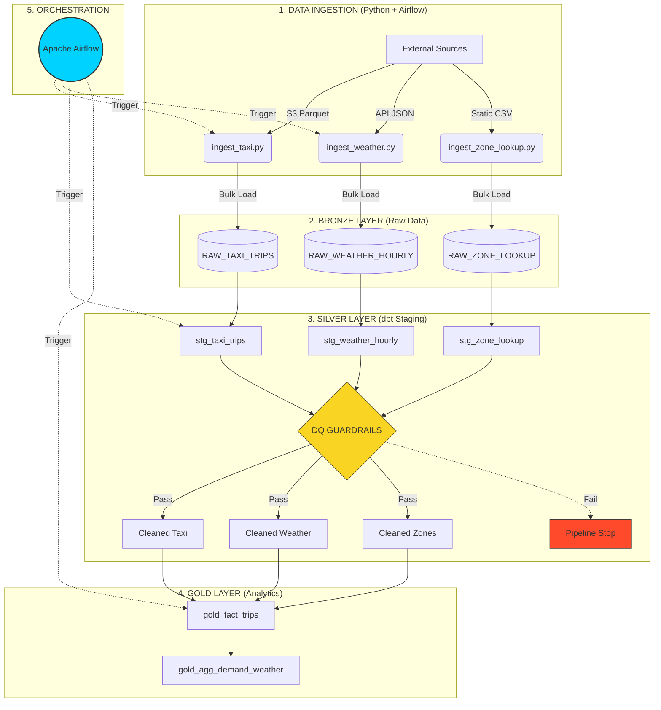

# UrbanFlow Analytics: NYC Taxi & Weather Platform

## 🏙️ Project Overview
This project is an end-to-end data engineering pipeline built for **UrbanFlow Analytics**. The goal is to help the **NYC Taxi & Limousine Commission (TLC)** understand how weather conditions (rain, snow, temperature) affect taxi demand patterns across New York City boroughs.

By combining millions of taxi trip records with historical weather data, we aim to answer key business questions:
- How does demand spike in specific boroughs during bad weather?
- What are the highest weather-correlated demand shifts?
- How do fares and trip durations change under different weather conditions?

## 🏗️ Architecture & Workflow
The project follows the industry-standard **Medallion Architecture**, ensuring data quality and reproducibility at every step.

### 🗺️ End-to-End System Workflow

### 🔄 The Medallion Logic
1.  **Bronze (Raw)**: Ingesting raw data from source systems (S3, Open-Meteo API) as-is.
2.  **Silver (Cleaned)**: Cleaning, validating, and standardizing data using **dbt**.
3.  **Gold (Curated)**: Creating analytics-ready facts and dimensions for business reporting.

## 🛠️ Tech Stack
- **Orchestration**: Apache Airflow (Dockerized)
- **Data Warehouse**: Snowflake
- **Transformation**: dbt Core
- **Ingestion**: Python (Pandas, Requests, Snowflake-Connector)
- **Environment**: Docker, Python 3.12, `uv`

---

## 🚀 Project Progress

### Phase 1: Bronze Layer (Ingestion) - ✅ 100% Complete
- [x] **NYC Taxi Data**: Ingested Jan/Feb 2023 Parquet files (~6M rows) using chunked/batch processing.
- [x] **Weather Data**: Automated ingestion of hourly historical data from Open-Meteo API.
- [x] **Zone Lookup**: Ingested static NYC TLC geography reference data.
- [x] **Auditability**: All Bronze tables include `SOURCE_FILE` and `LOADED_AT` audit columns.

### Phase 2: Silver Layer (Transformation) - ✅ 100% Complete
- [x] **dbt Source Declarations**: Defined in `models/sources.yml`.
- [x] **Schema Routing**: Implemented `generate_schema_name` macro for professional Medallion schema organization.
- [x] **Taxi Staging Model**: `stg_taxi_trips.sql` implemented with:
    - [x] Microsecond precision timestamp correction.
    - [x] MD5 Surrogate Key generation.
    - [x] Deduplication (keeping the latest `LOADED_AT` version).
    - [x] Business rule filtering (5.4M clean rows).
- [x] **Weather Staging Model**: `stg_weather_hourly.sql` implemented with:
    - [x] Custom `classify_weather` dbt macro for WMO code mapping.
    - [x] View materialization strategy for cost-efficiency.
    - [x] Feature engineering (`is_precipitation` flag).
- [x] **Zone Lookup Staging**: `stg_zone_lookup.sql` implemented with:
    - [x] Defensive `COALESCE` handling for IDs 264 & 265 ("Unknown" zones).
    - [x] Table materialization for optimal join performance.
- [x] **Data Quality Layer**: `schema.yml` validation with `unique` and `not_null` guardrails across all Silver models.

### Phase 3: Gold Layer (Analytics) - 🔄 In Progress
- [ ] Weather & Taxi Join logic
- [ ] Aggregated Demand Analytics
- [ ] Data Lineage & Documentation

---

## ⚙️ Project Setup & Commands Used

### 1. Python Environment Setup (using `uv`)
We use [`uv`](https://github.com/astral-sh/uv) to manage our Python virtual environment and dependencies for speed and efficiency.
*   `uv venv --python 3.12` - Creates an isolated environment.
*   `uv add requirements.txt` - Installs dependencies.

### 2. dbt Execution
Commands are executed from the `dbt/urbanflow` directory:
*   `uv run dbt run --select silver` - Materializes all Silver models.
*   `uv run dbt test --select silver` - Executes all Data Quality guardrails for the Silver layer.
*   `uv run dbt list --select silver` - Verifies dbt configuration and model visibility.

### 📚 Learning Resources
Detailed architectural deep-dives and "Elite Engineering" patterns are documented in the following repository:
*   [`Learnings/dbt/01_basic_config_FAQs.md`](Learnings/dbt/01_basic_config_FAQs.md) - dbt configuration intuition.
*   [`Learnings/dbt/02_Silver_Stage_Taxi_Trips.md`](Learnings/dbt/02_Silver_Stage_Taxi_Trips.md) - Silver layer design patterns for event data.
*   [`Learnings/dbt/03_Silver_Stage_Weather_Hourly.md`](Learnings/dbt/03_Silver_Stage_Weather_Hourly.md) - Silver layer design patterns for time-series data.
*   [`Learnings/dbt/04_Silver_Stage_Lookup_zone.md`](Learnings/dbt/04_Silver_Stage_Lookup_zone.md) - Defensive engineering for reference data.
